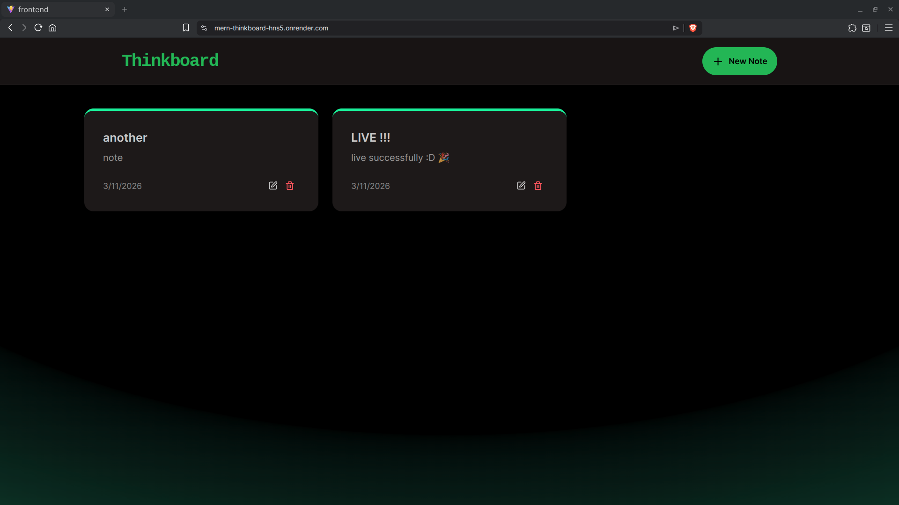
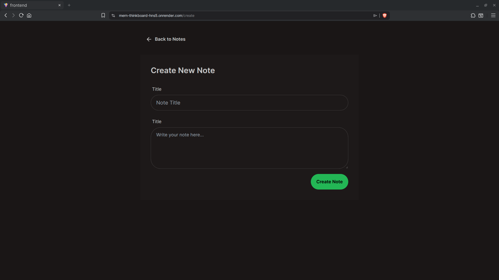
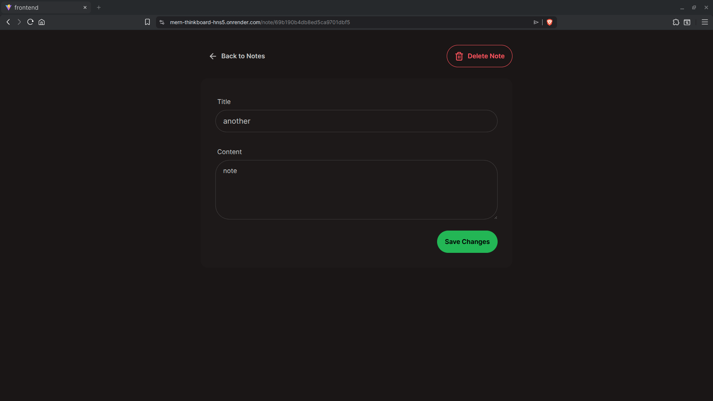
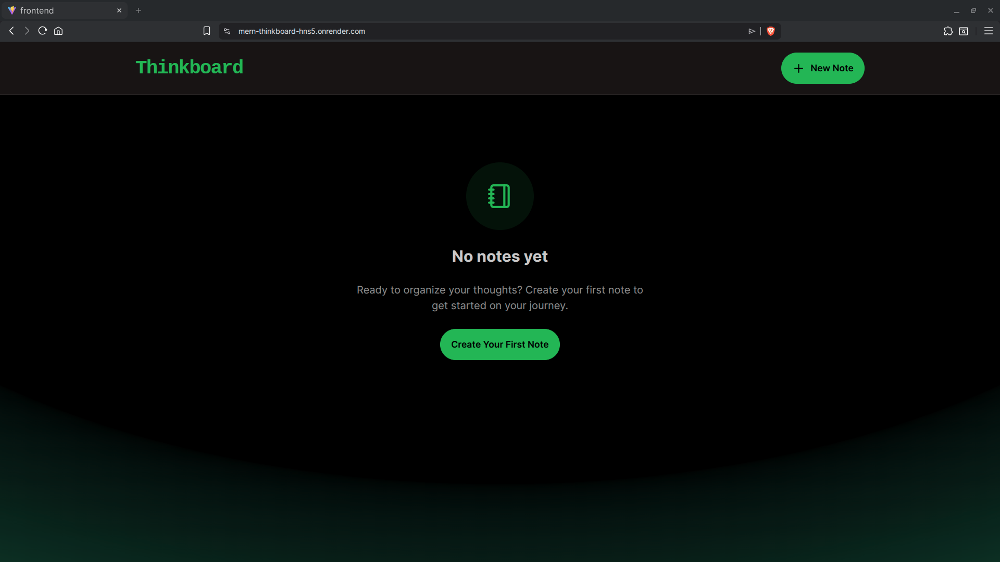

# 📝 ThinkBoard – MERN Notes App

ThinkBoard is a full-stack notes application built using the **MERN stack**.
It allows users to create, view, edit, and delete notes with a clean UI and rate-limited backend.

The project demonstrates **full-stack integration, API handling, state management, and modern UI design**.

---

## 🚀 Live Demo

🌐 **Deployed App:** https://mern-thinkboard-hns5.onrender.com/

---

## ✨ Features

* Create new notes
* View all saved notes
* Edit existing notes
* Delete notes
* Rate-limit protection on API
* Error handling and toast notifications
* Responsive UI

---

## 🛠 Tech Stack

### Frontend

* React
* Vite
* Axios
* DaisyUI + TailwindCSS
* React Router
* React Hot Toast
* Lucide Icons

### Backend

* Node.js
* Express.js
* MongoDB
* Mongoose
* Upstash Redis (Rate Limiting)

### Deployment

* Render

---

## 📂 Project Structure

```
thinkboard/
│
├── backend/
│   ├── src/
│   │   ├── controllers/
│   │   ├── models/
│   │   ├── routes/
│   │   └── server.js
│
├── frontend/
│   ├── src/
│   │   ├── components/
│   │   ├── pages/
│   │   └── lib/
│
└── README.md
```

---

## ⚙️ Installation (Run Locally)

### 1️⃣ Clone the repository

```
git clone https://github.com/yourusername/thinkboard.git
cd thinkboard
```

---

### 2️⃣ Install dependencies

Backend:

```
cd backend
npm install
```

Frontend:

```
cd ../frontend
npm install
```

---

### 3️⃣ Environment Variables

Create a `.env` file inside **backend/**

```
MONGO_URI=your_mongodb_connection_string
UPSTASH_REDIS_REST_URL=your_upstash_url
UPSTASH_REDIS_REST_TOKEN=your_upstash_token
PORT=5001
```

---

### 4️⃣ Run the backend

```
cd backend
npm run dev
```

---

### 5️⃣ Run the frontend

```
cd frontend
npm run dev
```

Frontend will run on:

```
http://localhost:5173
```

---

## 📸 Screenshots

<p align="center">
  
  
</p>

<p align="center">
  
  
</p>

---

## 🤝 Contributing

Pull requests are welcome. For major changes, please open an issue first.

---

## 👨‍💻 Author

Built by **P GB**

GitHub: https://github.com/priyangshuGB
